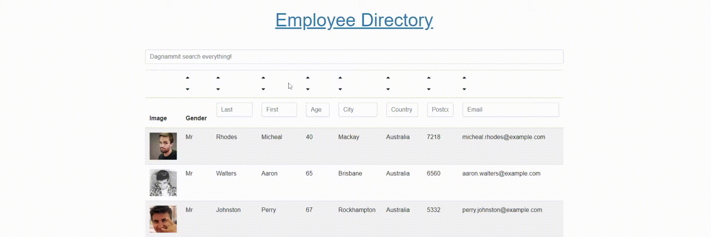

# Employee Directory
## Table of Contents
> - [Description](#Description)
> - [Table of Contents](#Table-of-Contents)
> - [Installation](#Installation)
> - [Usage](#Usage)
> - [License](#License)
> - [Contributing](#Contributing)
> - [Tests](#Tests)
> - [Questions](#Questions)

## Description
Employee Directory with filter and sort capability.
User can

- filter any field
- filter all fields
- sort by any field

Currently the user cannot filter by more than one field at a time.

* [View the deployed app on Heroku](https://floating-cliffs-70230.herokuapp.com/)
* [View it on GitHub](https://github.com/FSC-Portfolio/pwa-budget-tracker)

## Installation
Clone the repo, navigate to the root folder, run npm install.
## Usage
Filter and sort employees provided by the [Random User API](https://randomuser.me/).
## License
This application is covered under the MIT license.
## Contributing
Please report any bugs :)
## Tests
No tests required.
## Questions
Please refer any questions to  via jayarghargh@gmail.com.

>  This README.md created with .

